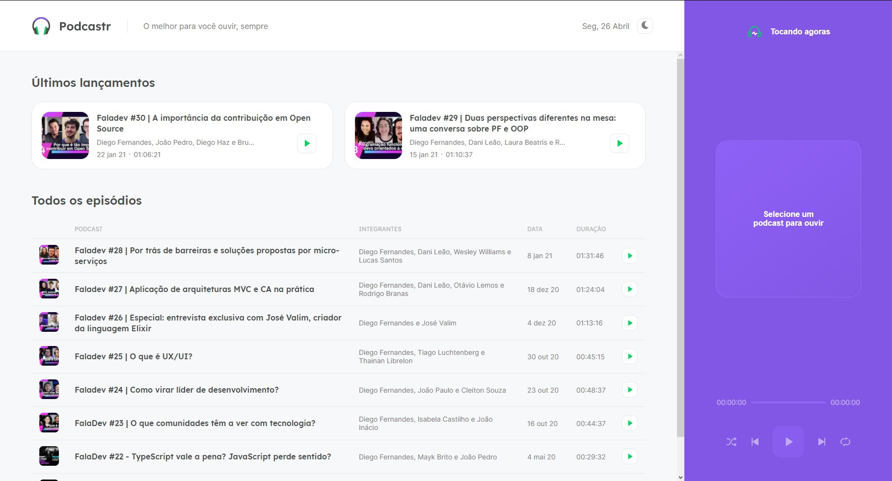
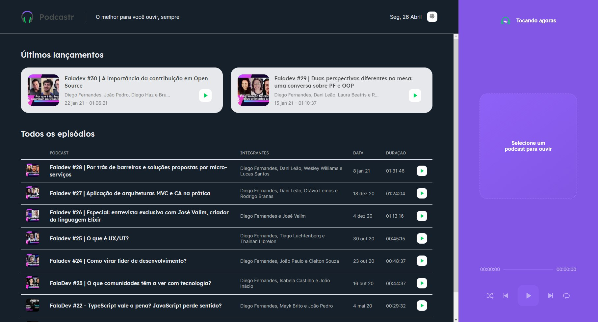

<h1 align="center">
    <br>
    
</h1>
<h4 align="center">
    Trilha ReactJS
</h4>
<p align="center">
    <a aria-label="Completado" href="https://nextlevelweek.com/episodios/react/5/edicao/5">
        </img>
    </a>
    <a href="https://github.com/flpfrnc/podcastr/blob/main/LICENSE">
        
    </a>
</p>
<p align="center">
    <a href="#podcastr">Projeto</a>&nbsp;&nbsp;&nbsp;|&nbsp;&nbsp;&nbsp;
    <a href="#tecnologias">Tecnologias</a>&nbsp;&nbsp;&nbsp;|&nbsp;&nbsp;&nbsp;
    <a href="#layout">Layout</a>&nbsp;&nbsp;&nbsp;|&nbsp;&nbsp;&nbsp;
    <a href="#licença-%EF%B8%8F">Licença</a>
</p>

Projeto de construção de WebApp durante o NLW#05 com a Rocketseat/Diego Fernandes. 

#### PODCASTR:
###### O melhor para você ouvir, sempre. 🎧🎶

<br>

#### Funcionalidades
* Escutar podcast.
* Visualizar sobre o que se trata o podcast.
* Gerenciar podcasts.
* ❌ Modal Cookies consent
* ❌ Site responsivo.

<details>
    <summary>Melhoras a serem implementadas</summary>

```
✔ - Documentar bem o projeto
✖ - Melhorar o estilo: Responsividade e Design
✖ - Banco de dados
✖ - Next PWA

Funcionalidades:
    ✔ Trocar o tema da aplicação: Light e Dark
    ✖ - COOKIES:
        - Cookies consent
        - Guardar dados
        - Alterar dados
        - Deletar dados
    ✖ - SQL:
        - Guardar dados
        - Alterar dados
        - Deletar dados
    - Telas:
        ✔ - Home
        ✔ - Episodes
        - 404
```
</details>

<br>

## Tecnologias 🚀
Esse projeto foi desenvolvido com as seguintes tecnologias:
- [Html | 5](https://pt.wikipedia.org/wiki/HTML)
- [Sass | ^1.32.11](https://sass-lang.com/)
- [Typescript | ^4.2.4](https://www.typescriptlang.org/)
- [ReactJS | ^17.0.2](https://pt-br.reactjs.org/)
- [NextJS | ^10.1.3](https://nextjs.org/)
- [NodeJS | ^14.16.1](https://nodejs.org/en/)

## Layout 
<div id="layout" style="display: flex; flex-direction: 'column'; align-items: 'center';">
<!-- Responsive, 1440 x 900, 50% (Laptop L - 1440px)-->
    
    
</div>

## Rodando o projeto na sua maquina:
<details>
    <summary>Dependências</summary>

```json
    "dependencies": {
        "axios": "^0.21.1",
        "date-fns": "^2.21.1",
        "next": "10.1.3",
        "rc-slider": "^9.7.2",
        "react": "17.0.2",
        "react-dom": "17.0.2",
        "sass": "^1.32.11"
    },
    "devDependencies": {
        "@types/node": "^14.14.41",
        "@types/react": "^17.0.3",
        "@types/react-dom": "^17.0.3",
        "json-server": "^0.16.3",
        "typescript": "^4.2.4"
    }
    //Ex: $ npm install @types/_____ -D
```
</details>

```bash
# Clone o repositório
$ git clone https://github.com/flpfrnc/podcastr.git

# Acesse a pasta do projeto
$ cd podcastr

# Instale as dependências
$ npm install
ou
$ yarn install

# Execute o script "server"
$ npm run server
ou
$ yarn server

# Execute o script "dev"
$ npm run dev
ou
$ yarn dev

# O projeto inciará na porta: 3000 - acesse http://localhost:3000
```

## Contribuição
**Diego Fernandes** da Rocketseat que disponibilizou video aulas do projeto **Podcastr**

## Licença
Este projeto está sob a licença do MIT. [LICENSE](https://github.com/flpfrnc/podcastr/blob/main/LICENSE).

<p align="left">
    <a href="https://www.linkedin.com/in/flpfranca/">
        
    </a>
</p>
